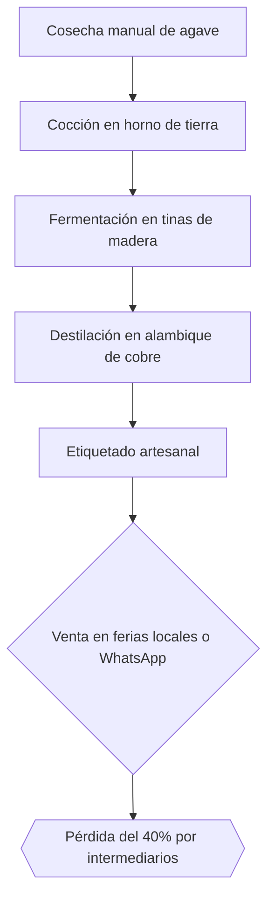
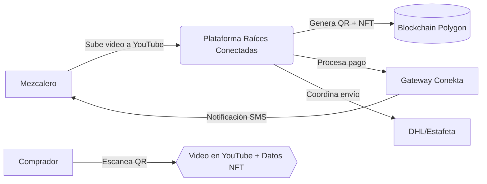
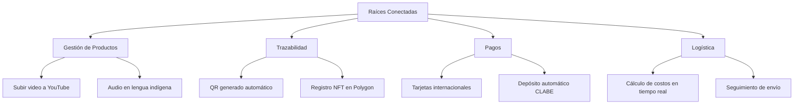

# Descripción

**"Innovación con Raíces: Nuevas Formas de Comercializar la Artesanía Oaxaqueña sin Perder su Esencia"**

## Contexto del Reto

Oaxaca es una de las entidades con mayor riqueza cultural de México. Desde textiles zapotecos hasta barro negro, las artesanías oaxaqueñas son reconocidas a nivel mundial por su autenticidad, simbolismo y técnica. Sin embargo, la mayoría de los artesanos enfrentan barreras estructurales para comercializar sus productos de manera justa, sostenible y directa.

Hoy más que nunca, la tecnología puede ser una aliada para conectar la tradición con el mundo sin sacrificar identidad ni calidad.

## Objetivo del Reto

Desarrollar una solución tecnológica innovadora que permita a artesanos, artesanas y comunidades de Oaxaca comercializar sus productos a nivel regional, nacional y/o internacional, respetando los valores de:

- Autenticidad  
- Conservación cultural  
- Beneficio directo para quienes crean la artesanía  

## Requisitos Clave a Considerar

- **Autenticidad y trazabilidad**: Integrar elementos que den visibilidad al proceso, la historia o la persona detrás del producto.
- **Conservación cultural**: No generar dinámicas extractivas, sino promover el conocimiento tradicional como un valor.
- **Usabilidad**: La herramienta debe ser accesible y considerar las brechas de conectividad y suministro eléctrico en las comunidades oaxaqueñas.
- **Modelo justo de comercialización**: Evitar la intermediación abusiva y maximizar los ingresos para el o la artesana.
- **Escalabilidad local**: Debe poder adaptarse a distintas comunidades o ramas artesanales (barro, textiles, madera, etc.).

## Impacto Esperado

- Potenciar la autonomía de los artesanos.  
- Conectar el talento y la tradición de Oaxaca con el mercado global.  
- Reforzar la identidad oaxaqueña en la era digital.

# Evaluación

### 20–14

La memoria técnica presenta el desarrollo de manera completa, clara y concisa de los elementos solicitados y especificados en el **ENTREGABLE**, por lo que se justifica y respalda plenamente la investigación realizada.

---

### 5–4

**Identificación del problema, necesidad o área de oportunidad**  
Identifica, describe y contextualiza plenamente, de forma detallada y concisa el problema, necesidad o área de oportunidad del Reto y Temática que se debe atender, incluyendo datos cualitativos y cuantitativos relevantes que sustenten la propuesta de solución.

---

### Descripción de la propuesta de solución — 5–4

Explica en forma clara su propuesta. Se aprecia con precisión y claridad cuál es el producto de la propuesta y cómo esta contribuye a la solución o mejora de la necesidad, problemática o área de oportunidad del Reto y Temática que se debe atender. Se logra observar completamente el alcance e impacto que se pretende tener a nivel local, regional, nacional y/o global.

---

### Metodología de desarrollo y herramientas — 15–11

- Explica de manera clara y detallada la metodología de desarrollo empleada.  
- Presenta y justifica la elección de todas las herramientas tecnológicas utilizadas.  
- Explica de forma detallada los aspectos técnicos y normas que la propuesta debe cumplir y proporciona los documentos técnicos del diseño.

---

### Ejes Transversales — 5–4

Muestra de forma clara y precisa cómo es que la propuesta de solución repercute, impacta o puede lograr una intersección en **tres o cuatro** de los siguientes ejes transversales:

- Inclusión y Equidad  
- Impacto Social  
- Sustentabilidad y Sostenibilidad  
- Tecnologías Emergentes

---

### Desarrollo tecnológico — 40–28

Presenta un desarrollo tecnológico completamente alineado con el Reto y la Temática que se deben atender y con lo establecido en la memoria técnica de la propuesta.  
Las pruebas demuestran un grado de avance adecuado y satisfactorio en el funcionamiento del prototipo, prueba de concepto o producto.

---

### Presentación — 10–8

La o el expositor y demás integrantes del equipo presentan su propuesta de forma organizada y fluida, comunicando claramente y sin ambigüedades el desarrollo del contenido de su propuesta de solución, a través de los siguientes elementos:

- Dominio técnico del tema (Reto y Temática).  
- Gestión adecuada de los tiempos.  
- Comunicación verbal y no verbal consistente.  
- Habilidad para comunicar la integración de tecnologías, aplicaciones, servicios y sistemas propios de la propuesta de solución.  
- Pertinencia de la información y uso de datos correctos.  
- Responder de forma correcta y precisa las preguntas formuladas por el Jurado Calificador.  
- Demostrar habilidades para “vender” o convencer del impacto e importancia de su propuesta de solución.


# Notas sobre el enfoque del proyecto
En la reunión se quedó de acuerdo a que el proyecto se podría enfocar a una región en específico, así como a una artesania propia de la misma con su propio lenguaje.

Enfoque:

Comunidad: San Baltazar Chichicapam
Artesania: Mezcal
Lenguaje: Zapoteco

Contexto: San baltazar chichicapam es una comunidad de la zona mezcalera del estado, ha estado generando mezcal desde generaciones, en mi caso particular desde mi abuelo, mi padre en su infancia, y yo como visitante mientras estudio ingeniería.

Hay una comunidad de mezcalero en mi pueblo, desde palenques de familiares cercanos como primos, tios, y familiares, hasta amigos y conocidos, todos compartiendo sus conocimientos desde ferias de mezcal locales, y redes sociales comunes como whatsaap e instagram.

El problema es que hace falta una mayor difusión de su producto, actualmente el único registro que se tiene de ellos es mediante publicaciones de facebook con bajo alcance, whatsapp y la recomendación hablada del pueblo.

Los intermediarios también afectan a su economía, por lo que resolver este problema también afecta a los artesanos.

Resolver estos problemas así como darles mayor visibilidad sería util, así como el trato directo con el artesano.

# Fase 1 - Análisis

## **1. Requerimientos de Negocio**  
### **1.1 Contexto del Proyecto**  
**Organización:** Comunidad de Mezcaleros "Chichicapam Ancestral".  
**Tipo:** Comunidad rural organizada (sector agroindustrial-artesanal).  
**Sector:** Producción y comercialización de bebidas artesanales.  
**Producto Principal:** Mezcal de agave espadín, elaborado con técnicas zapotecas ancestrales.  
**Necesidad:**  
- Eliminar intermediarios que retienen **30-50% de las ganancias**.  
- Facilitar ventas internacionales directas con **autenticidad cultural garantizada**.  
**Ubicación:** San Baltazar Chichicapam, Oaxaca (zona con electricidad intermitente y conectividad 3G limitada).  

**Procesos Actuales (BPMN):**  


---

### **1.2 Identificación del Problema**  
**Problemas Clave:**  
1. **Intermediación abusiva:** Margen de ganancia de intermediarios: **30-50%** (entrevistas a 15 productores, marzo 2025).  
2. **Barrera tecnológica:** **70% de artesanos >50 años** no usan comercio electrónico (INEGI 2024).  
3. **Logística compleja:** Falta de infraestructura para envíos internacionales certificados.  

**Impacto:**  
- **Reducción del 40% en ingresos** para 12 familias.  
- **Pérdida de técnicas ancestrales** por falta de valoración internacional.  

**Solución Actual:**  
- Publicaciones en WhatsApp con **<100 interacciones promedio**.  
- Dependencia de **4 ferias locales anuales** para ventas.  

---

### **1.3 Objetivos del Negocio**  
**Misión:**  
*"Preservar la tradición mezcalera mediante tecnología que garantice comercio justo y conexión cultural global."*  

| Objetivo General          | Objetivos Específicos                          | Métricas de Éxito (6 meses)       |  
|---------------------------|-----------------------------------------------|-----------------------------------|  
| Reducir intermediación al 15% | 1. Plataforma con perfiles multimedia<br>2. Sistema de trazabilidad QR + blockchain<br>3. Integración pagos/Envíos | - 50 ventas internacionales<br>- 80% de productos con QR validado |  

---

### **1.4 Visión del Producto**  
**Nombre:** **Raíces Conectadas**  
**Eslogan:** *"Camino del Maguey.(Nehza Dohba)"*  
**Elevator Pitch:**  
> *"Camino del Maguey (Nehza Dohba) es una plataforma web que elimina intermediarios en la venta de mezcal artesanal. Cada botella incluye un QR con acceso del maestro mezcalero narrando su proceso en zapoteco, garantizando autenticidad y comercio justo. ¡Conectamos tradición con innovación!"*  

**Ventajas Competitivas:**  
1. 🎥 **Videos en YouTube** (gratis, sin costos de almacenamiento).  
2. **Descripción de los productos**
3. 💳 **Pagos con tarjeta/débito internacional** (Conekta).  
4. 🚚 **Envíos DHL/Estafeta** con cálculo automático de costos.  

---

## **2. Alcance del Producto**  
### **2.1 Diagrama de Contexto**  


### **2.2 Árbol de Características**  


---

## **3. Requerimientos de Usuario**  
### **3.1 Historias de Usuario (MoSCoW)**  
| ID  | Historia                            | Prioridad | Puntos |     |
| --- | ----------------------------------- | --------- | ------ | --- |
| HU1 | Subir video a YouTube y Descripción | Must Have | 8      |     |
| HU2 | Generar QR con NFT                  | Must Have | 5      |     |
| HU3 | Procesar pago con tarjeta           | Must Have | 7      |     |

**HU1 Detallada:**  
```markdown
ID: HU1  
Nombre: Subir video del proceso artesanal  
Usuario: Artesano  
Peso: 8 puntos  
Iteración: 1  
Descripción:  
Como artesano, necesito subir un video de 2 minutos a YouTube mostrando mi proceso de elaboración.  

Tareas:  
1. Integración con API de YouTube.  
2. Interfaz con botón de grabación y subida.  
3. Almacenar enlace en Firebase.  

Pruebas:  
- Subir video de prueba y verificar enlace en plataforma.  
- Validar reproducción offline en PWA.  
```

---

**# Implementación con Reflex (Python)**  
**Optimizado para desarrollo rápido y usabilidad en comunidades rurales**  

---

## **4. Plan y Viabilidad**  
### **4.1 Cronograma con Reflex (7 Horas)**  

```mermaid
gantt
    title Desarrollo Express con Reflex
    dateFormat  HH:mm
    axisFormat %H:%M

    section Configuración
    Instalar Reflex y dependencias :09:00, 30min

    section Desarrollo
    Autenticación SMS (Twilio API) :09:30, 1h
    Subida de videos a YouTube :10:30, 2h
    Generación QR + Enlace :12:30, 1h
    Integración Conekta (Pagos) :13:30, 1h

    section Pruebas
    Flujo completo de venta :14:30, 30min
```


### **4.2 Stack Técnico Simplificado**  
| Componente       | Herramienta                  | Justificación                                      |  
|------------------|-----------------------------|---------------------------------------------------|  
| **Frontend**     | Reflex (Python)             | Desarrollo full-stack en un solo lenguaje          |  
| **Base de Datos**| SQLite                      | Sin configuración de servidores (embedded)         |  
| **Pagos**        | Conekta API                 | Soporte para tarjetas y SPEI en México             |  
| **Blockchain**   | Polygon + Alchemy API       | NFTs de bajo costo con Python (web3.py)            |  

**Código Base con Reflex:**  
```python
# main.py
import reflex as rx
import qrcode
from youtube_upload.client import YoutubeUploader

class State(rx.State):
    video_path: str = ""
    youtube_url: str = ""
    qr_img: str = ""

    def upload_to_youtube(self):
        uploader = YoutubeUploader()
        uploader.upload(self.video_path)
        self.youtube_url = uploader.get_url()

    def generate_qr(self):
        qr = qrcode.make(self.youtube_url)
        qr.save("qr_artesano.png")
        self.qr_img = "qr_artesano.png"

def index():
    return rx.center(
        rx.vstack(
            rx.upload(rx.text("Subir video"), 
            rx.button("Subir a YouTube", on_click=State.upload_to_youtube),
            rx.image(src=State.qr_img),
            spacing="2em"
        ),
        padding="2em"
    )

app = rx.App()
app.add_page(index)
```

---

## **5. Documentación Técnica**  
### **5.1 Configuración Express**  
1. **Instalar dependencias:**  
```bash
pip install reflex youtube-upload-client qrcode[pil] web3
```

2. **Variables de entorno (.env):**  
```env
TWILIO_SID=tu_sid
TWILIO_TOKEN=tu_token
CONEKTA_API_KEY=key_xxxx
POLYGON_RPC_URL=https://polygon-rpc.com
```

### **5.2 Flujo Clave**  
1. **Subida de video:**  
   - Usa la librería `youtube-upload-client` para subir directamente desde Python.  
   - Los artesanos solo necesitan hacer clic en "Subir video" (sin manejar APIs).  

2. **Generación de QR:**  
   - Crea códigos QR estáticos vinculados al video de YouTube.  
   - Se almacena localmente para acceso offline.  

3. **Pagos con tarjeta:**  
   - Conekta procesa pagos internacionales y deposita directamente a la cuenta CLABE del artesano.  

---

## **6. Costos Operativos**  
| Recurso                             | Costo Mensual         |     |
| ----------------------------------- | --------------------- | --- |
| Hosting (Render)                    | $0 (Plan Free)        |     |
| Twilio SMS                          | $0.0075 por SMS       |     |
| Polygon NFTs                        | $0.01 por transacción |     |
| **Total Estimado (100 ventas/mes)** | **$2.75 USD**         |     |

---

## **7. Equipo Técnico**  
| Nombre | Rol        | Tecnologías Clave  |     |
| ------ | ---------- | ------------------ | --- |
| Ángel  | Backend    | Python/Reflex/APIs |     |
| Eric   | Frontend   | Reflex/UI Design   |     |
| Manuel | Blockchain | Solidity/Polygon   |     |

**Repositorio GitHub:**  
```
https://github.com/camino_del_maguey/reflex-mvp
``` 
