# Descripción

## Contexto del Reto

Oaxaca es una de las entidades con mayor riqueza cultural de México. Desde textiles zapotecos hasta barro negro, las artesanías oaxaqueñas son reconocidas a nivel mundial por su autenticidad, simbolismo y técnica. Sin embargo, la mayoría de los artesanos enfrentan barreras estructurales para comercializar sus productos de manera justa, sostenible y directa.

Hoy más que nunca, la tecnología puede ser una aliada para conectar la tradición con el mundo sin sacrificar identidad ni calidad.

## Objetivo del Reto

Desarrollar una solución tecnológica innovadora que permita a artesanos, artesanas y comunidades de Oaxaca comercializar sus productos a nivel regional, nacional y/o internacional, respetando los valores de:

- Autenticidad  
- Conservación cultural  
- Beneficio directo para quienes crean la artesanía  

## Requisitos Clave a Considerar

- **Autenticidad y trazabilidad**: Integrar elementos que den visibilidad al proceso, la historia o la persona detrás del producto.
- **Conservación cultural**: No generar dinámicas extractivas, sino promover el conocimiento tradicional como un valor.
- **Usabilidad**: La herramienta debe ser accesible y considerar las brechas de conectividad y suministro eléctrico en las comunidades oaxaqueñas.
- **Modelo justo de comercialización**: Evitar la intermediación abusiva y maximizar los ingresos para el o la artesana.
- **Escalabilidad local**: Debe poder adaptarse a distintas comunidades o ramas artesanales (barro, textiles, madera, etc.).

## Impacto Esperado

- Potenciar la autonomía de los artesanos.  
- Conectar el talento y la tradición de Oaxaca con el mercado global.  
- Reforzar la identidad oaxaqueña en la era digital.

# Evaluación

### 20–14

La memoria técnica presenta el desarrollo de manera completa, clara y concisa de los elementos solicitados y especificados en el **ENTREGABLE**, por lo que se justifica y respalda plenamente la investigación realizada.

---

### 5–4

**Identificación del problema, necesidad o área de oportunidad**  
Identifica, describe y contextualiza plenamente, de forma detallada y concisa el problema, necesidad o área de oportunidad del Reto y Temática que se debe atender, incluyendo datos cualitativos y cuantitativos relevantes que sustenten la propuesta de solución.

---

### Descripción de la propuesta de solución — 5–4

Explica en forma clara su propuesta. Se aprecia con precisión y claridad cuál es el producto de la propuesta y cómo esta contribuye a la solución o mejora de la necesidad, problemática o área de oportunidad del Reto y Temática que se debe atender. Se logra observar completamente el alcance e impacto que se pretende tener a nivel local, regional, nacional y/o global.

---

### Metodología de desarrollo y herramientas — 15–11

- Explica de manera clara y detallada la metodología de desarrollo empleada.  
- Presenta y justifica la elección de todas las herramientas tecnológicas utilizadas.  
- Explica de forma detallada los aspectos técnicos y normas que la propuesta debe cumplir y proporciona los documentos técnicos del diseño.

---

### Ejes Transversales — 5–4

Muestra de forma clara y precisa cómo es que la propuesta de solución repercute, impacta o puede lograr una intersección en **tres o cuatro** de los siguientes ejes transversales:

- Inclusión y Equidad  
- Impacto Social  
- Sustentabilidad y Sostenibilidad  
- Tecnologías Emergentes

---

### Desarrollo tecnológico — 40–28

Presenta un desarrollo tecnológico completamente alineado con el Reto y la Temática que se deben atender y con lo establecido en la memoria técnica de la propuesta.  
Las pruebas demuestran un grado de avance adecuado y satisfactorio en el funcionamiento del prototipo, prueba de concepto o producto.

---

### Presentación — 10–8

La o el expositor y demás integrantes del equipo presentan su propuesta de forma organizada y fluida, comunicando claramente y sin ambigüedades el desarrollo del contenido de su propuesta de solución, a través de los siguientes elementos:

- Dominio técnico del tema (Reto y Temática).  
- Gestión adecuada de los tiempos.  
- Comunicación verbal y no verbal consistente.  
- Habilidad para comunicar la integración de tecnologías, aplicaciones, servicios y sistemas propios de la propuesta de solución.  
- Pertinencia de la información y uso de datos correctos.  
- Responder de forma correcta y precisa las preguntas formuladas por el Jurado Calificador.  
- Demostrar habilidades para “vender” o convencer del impacto e importancia de su propuesta de solución.


# Notas sobre el enfoque del proyecto
En la reunión se quedó de acuerdo a que el proyecto se podría enfocar a una región en específico, así como a una artesania propia de la misma con su propio lenguaje.

Enfoque:

Comunidad: San Baltazar Chichicapam
Artesania: Mezcal
Lenguaje: Zapoteco

Contexto: San baltazar chichicapam es una comunidad de la zona mezcalera del estado, ha estado generando mezcal desde generaciones, en mi caso particular desde mi abuelo, mi padre en su infancia, y yo como visitante mientras estudio ingeniería.

Hay una comunidad de mezcalero en mi pueblo, desde palenques de familiares cercanos como primos, tios, y familiares, hasta amigos y conocidos, todos compartiendo sus conocimientos desde ferias de mezcal locales, y redes sociales comunes como whatsaap e instagram.

El problema es que hace falta una mayor difusión de su producto, actualmente el único registro que se tiene de ellos es mediante publicaciones de facebook con bajo alcance, whatsapp y la recomendación hablada del pueblo.

Los intermediarios también afectan a su economía, por lo que resolver este problema también afecta a los artesanos.

Resolver estos problemas así como darles mayor visibilidad sería util, así como el trato directo con el artesano.

# Fase 1 - Análisis: Camino del Maguey (Nehza Dohba) (Revisión Final)

## **1. Requerimientos de Negocio**

### **1.1 Contexto del Proyecto**

- **Nombre del Proyecto:** Camino del Maguey (Nehza Dohba)
- **Organización:** Iniciativa Comunitaria de Maestros Mezcaleros de San Baltazar Chichicapam.
- **Tipo:** Comunidad rural organizada (sector agroindustrial-artesanal) con apoyo de iniciativa tecnológica social.
- **Sector:** Producción y Comercialización Directa de Mezcal Artesanal con enfoque en Autenticidad y Cultura Digital.
- **Producto Principal:** Plataforma Digital (Web) para conectar productores de mezcal de San Baltazar Chichicapam con compradores finales. Ofrece trazabilidad por lote vía QR, storytelling cultural (incluyendo Zapoteco) y facilita el contacto directo (vía WhatsApp).
    
- **Necesidad Crítica:**
    - Eliminar intermediarios (actualmente retienen **30-50%** de ganancias).
    - Aumentar visibilidad y acceso a mercados conscientes.
    - Garantizar autenticidad cultural y trazabilidad simple.
    - Superar barreras tecnológicas y de conectividad intermitente (diseño _offline-first_).
- **Ubicación:** San Baltazar Chichicapam, Oaxaca. Área de influencia global para compradores.
- **Proceso Actual (Simplificado):**


- **Proceso Propuesto con Camino del Maguey (Nehza Dohba) (MVP):**


_(Diagrama corregido para claridad de flujo y conexiones)_

---

### **1.2 Identificación del Problema**

- **Problemas Clave:**
    
    1. **Intermediación Excesiva:** Reduce márgenes de ganancia en **30-50%**, desconectando al productor del valor final (Fuente: Entrevistas preliminares en Chichicapam).
    2. **Visibilidad Limitada:** Canales actuales (WhatsApp, Facebook bajo alcance, ferias locales) no acceden a mercado nacional/internacional que valora autenticidad.
    3. **Brecha Digital y de Conectividad:** Dificultad para adoptar e-commerce tradicional por edad (% > 50 años) y conectividad intermitente (3G limitado/electricidad). **Requiere solución offline-first.**
    4. **Riesgo de Pérdida Cultural:** Falta de valoración económica directa pone en riesgo la transmisión de técnicas ancestrales y el uso del Zapoteco asociado al producto.
        
- **Impacto:**
    
    - Ingresos insuficientes/variables para familias productoras.
    - Desconocimiento del origen y proceso por parte del consumidor final.
    - Pérdida potencial de identidad cultural y lingüística asociada al mezcal.
        
- **Solución Actual / Inexistencia:** No existe una plataforma digital diseñada _específicamente_ para las necesidades y contexto de los maestros mezcaleros de Chichicapam, que combine trazabilidad simple, storytelling cultural (Zapoteco) y un modelo de negocio de contacto directo resiliente a la baja conectividad.
    

---

### **1.3 Objetivos del Negocio (Ajustados al MVP del Hackatec)**

- **Misión:** Empoderar a los Maestros Mezcaleros de San Baltazar Chichicapam para compartir y comercializar su mezcal directamente, preservando su herencia cultural y lingüística (Zapoteco) a través de tecnología accesible.
- **Objetivo General (Proyecto a Largo Plazo):** Reducir la intermediación drásticamente (<15%) y conectar cultural y comercialmente a la comunidad mezcalera de Chichicapam con un mercado global consciente.
- **Objetivo del Prototipo (Hackatec - 7 Horas):** **Demostrar un flujo funcional Mínimo Viable (MVP) que valide la conexión directa Productor-Consumidor mediante QR, enfocándose en la autenticidad, el storytelling cultural (video, Zapoteco) y la viabilidad técnica de una solución con capacidad offline.**
- **Objetivos Específicos (MVP - 7 Horas):**
    1. **OE1:** Implementar registro básico de `LoteMezcal` (datos clave, enlace video YT, fotos) demostrando una **estrategia funcional para el guardado offline** (simulada si es necesario, pero clara).
    2. **OE2:** Desarrollar la generación de un ID/URL único por lote y la capacidad de generar un **Código QR** que lo represente.
    3. **OE3:** Crear un **Visor Web** público que, al recibir el ID del lote, muestre información del lote, datos del maestro (incluyendo placeholder/enlace audio Zapoteco) y video embebido de YouTube.
    4. **OE4:** Integrar un botón/enlace funcional de **Contacto Directo vía WhatsApp** en el Visor Web.
        
- **Métricas de Éxito (Prototipo Hackatec):**
    
    - **ME1:** Flujo completo demostrable y funcional: Registro (con simulación offline) -> QR -> Escaneo (simulado) -> Visualización Web -> Clic en Contacto WhatsApp. (**FUNCIONALIDAD CORE**)
    - **ME2:** Código fuente organizado, comentado y que refleje las decisiones de diseño del MVP. (**CALIDAD TÉCNICA**)
    - **ME3:** Presentación clara y convincente del problema, la solución MVP, su impacto potencial y la estrategia futura. (**COMUNICACIÓN E IMPACTO**)

---

### **1.4 Visión del Producto (Ajustada)**

- **Nombre:** Camino del Maguey (Nehza Dohba)
    
- **Eslogan:** _Conectando Origen y Corazón._
    
- **Elevator Pitch:**
    
    > Para compradores de mezcal que buscan **autenticidad y conexión real**, **Camino del Maguey (Nehza Dohba)** es una plataforma digital que, mediante un **QR en cada botella**, te lleva a conocer la **historia única del lote y del Maestro Mezcalero de San Baltazar Chichicapam** que lo creó, incluso escuchando su voz en **Zapoteco**. A diferencia de marcas genéricas o intermediarios, facilitamos el **contacto directo vía WhatsApp** para un comercio **justo y transparente**, con una solución diseñada para funcionar **incluso con baja conectividad**. ¡Conectamos tradición, raíz y corazón!
    
- **Ventajas Competitivas Clave (MVP):**
    
    1. **Trazabilidad Hiperlocal Auténtica:** Conexión directa verificable al maestro y lote específicos de Chichicapam.
    2. **Storytelling Cultural Profundo:** Valorización de la identidad a través de video, historia y lengua Zapoteca.
    3. **Comercio Directo Simplificado:** Modelo adaptado al contexto local vía WhatsApp, fomentando la equidad.
    4. **Diseño Resiliente (Offline-First):** Arquitectura pensada para superar la brecha de conectividad rural.
        

---

## **2. Alcance del Producto de Software (MVP Hackatec)**

### **2.1 Diagrama de Contexto (Simplificado y Corregido)**


- **Descripción:** El Maestro Mezcalero utiliza la App Web/PWA (con capacidad offline) para registrar lotes y asociar medios (video de YouTube). La plataforma genera una URL única y un QR. El Comprador escanea el QR, accede a la plataforma web, visualiza la información del lote/maestro (incluyendo el video embebido) y puede iniciar contacto directo vía un enlace de WhatsApp.

### **2.2 Árbol de Características (MVP Hackatec)**


- **Inclusiones Clave MVP:** Registro Maestro/Lote (con estrategia clara offline), asociación video YT/fotos, generación QR, visor web público con info completa y botón funcional de contacto WhatsApp.
- **Exclusiones Clave MVP:** NFTs, Pagos integrados, Logística, Catálogo complejo, Admin avanzado.

---

## **3. Requerimientos de Usuario (MVP Hackatec)**

### **3.1 Historias de Usuario Clave (Priorizadas con MoSCoW)**

|ID|Historia|Prioridad|Puntos|Épica Relacionada|
|:--|:--|:--|:--|:--|
|**HU-L1**|Como **Maestro Mezcalero**, quiero registrar los datos básicos de un nuevo lote (agave, notas) y asociar un link de video de YouTube, **pudiendo guardar offline** y sincronizar después.|Must Have|8|Gestión de Lotes|
|**HU-L2**|Como **Maestro Mezcalero**, quiero que el sistema genere automáticamente un **Código QR único** para cada lote que registro.|Must Have|3|Gestión de Lotes, Trazabilidad|
|**HU-C2**|Como **Comprador**, al escanear el QR, quiero ver una página web clara con la **info del lote, del maestro, el video del proceso** y sentir que es auténtico.|Must Have|5|Visualización, Experiencia Comprador|
|**HU-C4**|Como **Comprador**, quiero encontrar fácilmente un **botón para contactar al Maestro vía WhatsApp** directamente desde la página de información del lote.|Must Have|3|Comunicación Directa|
|HU-M1|Como **Maestro Mezcalero**, quiero tener un perfil básico donde pueda poner mi nombre, una breve historia y mi número de WhatsApp para contacto.|Should Have|5|Gestión de Maestros|
|HU-L3|Como **Maestro Mezcalero**, quiero poder añadir fotos del proceso o del producto terminado a la información de cada lote.|Should Have|4|Gestión de Lotes|
|HU-M2|Como **Maestro Mezcalero**, quiero poder incluir un enlace a un archivo de audio con un saludo/historia en Zapoteco en mi perfil.|Could Have|3|Gestión de Maestros, Cultura|
|HU-A1|Como **Admin del Proyecto**, quiero poder revisar y marcar como "validados" a los maestros registrados (mecanismo simple).|Won't Have|2|Administración|

- **HU-L1 Detallada (Ejemplo con Énfasis en Estrategia Offline):**
    
    ```markdown
    ID: HU-L1
    Nombre: Registrar Lote de Mezcal con Capacidad Offline
    Usuario: Maestro Mezcalero
    Peso: 8 puntos
    Iteración: 1
    Descripción:
    Como Maestro Mezcalero, necesito registrar la información esencial de un nuevo lote de mezcal (agave, notas, link video YT) usando una interfaz simple. **Es CRUCIAL que pueda iniciar y guardar este registro AUNQUE esté offline**, para luego enviarlo/sincronizarlo cuando tenga conexión.
    
    Tareas Clave (Diseño/Implementación):
    1. Interfaz simple para datos del lote + link YT + carga de fotos.
    2. **Implementar Almacenamiento Local:** Usar `localStorage` o `IndexedDB` (si es PWA con Reflex) o estado persistente simple para guardar datos del formulario temporalmente en el dispositivo del usuario.
    3. **Detección de Conectividad:** Usar APIs del navegador (`navigator.onLine`) para saber el estado.
    4. **Mecanismo de Sincronización:** Botón "Guardar Offline" y "Sincronizar Ahora" (o sincronización automática al detectar conexión) que envíe los datos locales al backend.
    5. Asociar el lote al Maestro.
    
    Pruebas de Aceptación (MVP):
    - [X] Puedo abrir formulario de registro offline.
    - [X] Puedo llenar campos y guardar **localmente** sin conexión (verificar en DevTools/Estado).
    - [X] Al conectar y/o presionar "Sincronizar", los datos se envían (verificar petición de red o BD simulada).
    - [X] Link de YouTube y referencia a fotos (si se implementa) se guardan.
    ```
    

---

## **4. Plan y Viabilidad (MVP Hackatec - 7 Horas)**

### **4.1 Cronograma con Reflex (Ajustado y Realista)**

```mermaid
gantt
    title Cronograma MVP "Camino del Maguey (Nehza Dohba)" (7 Horas)
    dateFormat HH:mm
    axisFormat %H:%M

    section Configuración y Base (0:45)
    Config. Inicial Reflex + SQLite Schema        :done, 00:00, 45min

    section Desarrollo Core (4:15)
    Backend: Modelos Datos + API básica           :active, 00:45, 60min
    Frontend: Formulario Lote + Guardado Offline  :active, 01:45, 75min
    Backend: Lógica ID/URL + Gen QR               :active, 03:00, 30min
    Frontend: Visor Web + API + YT                :active, 03:30, 90min

    section Integración y Finalización (2:00)
    Botón WhatsApp Funcional                      :active, 05:00, 30min
    Pruebas E2E + Ajustes UI/UX                   :active, 05:30, 60min
    Demo + Memoria Técnica Final                  :active, 06:30, 30min

```



- **Nota:** La **simulación** del guardado offline es clave para la demo en 7h. Explicar claramente la arquitectura _real_ (PWA, Service Workers, IndexedDB/SQLite) en la presentación/memoria.

### **4.2 Stack Técnico (Enfocado en MVP)**

|Componente|Herramienta Propuesta|Justificación (Hackatec MVP)|
|:--|:--|:--|
|**Framework Web**|**Reflex (Python)**|Desarrollo rápido Fullstack en Python. Ideal si el equipo tiene experiencia. Permite crear UI interactiva.|
|**Base de Datos**|**SQLite**|Simple, sin servidor, ideal para MVP. Puede usarse en backend y potencialmente en frontend (PWA).|
|**Gestión QR**|**Librería `qrcode` (Python)**|Estándar y fácil para generar QR desde la URL generada.|
|**Hosting Video**|**YouTube**|Solución robusta y gratuita para videos. Se gestiona externamente, la app solo enlaza.|
|**Comunicación**|**Link Directo WhatsApp (`wa.me`)**|Efectivo, sin costo, sin API compleja para MVP, usa app existente.|
|**Hosting App MVP**|**Render / PythonAnywhere (Free)**|Despliegue rápido y gratuito para prototipos Python/Reflex.|
|~~_Pagos_~~|_~~(Conekta API)~~_|_Deferido del MVP - Complejidad Alta_|
|~~_Blockchain_~~|_~~(Polygon + web3.py)~~_|_Deferido del MVP - Complejidad Alta_|

### **4.3 Viabilidad Simplificada (Hackatec)**

- **Técnica:** **Viable.** El MVP simplificado es alcanzable. El stack es manejable. **Reto principal:** Demostrar convincentemente la capacidad offline (incluso simulada) y explicar la arquitectura robusta planeada.
- **Económica:** **Muy Alta.** Costos operativos del MVP cercanos a cero. El modelo de negocio se basa en habilitar ventas directas, no en monetizar la plataforma directamente (al menos inicialmente).
- **Operativa:** **Alta (Conceptual).** El éxito a largo plazo depende de la **simplicidad de la interfaz** para los maestros y de la **capacitación/soporte**. El uso de WhatsApp reduce la curva de aprendizaje. La participación comunitaria es clave y un punto fuerte de este equipo.
    

---

## **5. Documentación Técnica (Base para MVP)**

### **5.1 Configuración Express (Ajustada)**

1. **Instalar dependencias:**
    ```bash
    pip install reflex qrcode[pil]
    # Posiblemente: sqlalchemy (si se usa con SQLite en backend Reflex)
    ```
    
2. **Variables de entorno (`.env`) - Mínimas:**
    ```env
    # URL base para construir los enlaces del QR
    PLATFORM_BASE_URL=https://camino-del-maguey-mvp.onrender.com
    ```

### **5.2 Flujo Clave (Simplificado)**

1. **Registro de Lote (Maestro):** Usa interfaz Reflex (PWA). Ingresa datos + link YT. **Guarda localmente** (simulado con estado/localStorage). Opcional: Sincroniza al detectar conexión -> Backend guarda en SQLite.
2. **Generación de QR (Sistema):** Backend genera ID único (`idLote`), construye URL (`PLATFORM_BASE_URL/lote/idLote`), genera imagen QR (`qrcode`). Muestra QR al maestro.
3. **Visualización (Comprador):** Escanea QR -> Accede URL -> Reflex routea -> Backend consulta BD por `idLote` -> Frontend renderiza info (datos lote/maestro, video YT embebido, botón `wa.me/NumMaestro`).

---

## **6. Costos Operativos (Estimación MVP)**

|Recurso|Costo Mensual (Estimado)|Notas|
|:--|:--|:--|
|Hosting App (Free Tier)|$0|Render, PythonAnywhere, etc.|
|Base de Datos (SQLite)|$0|Incluida en hosting.|
|YouTube Hosting|$0|Gratuito.|
|WhatsApp Links|$0|Funcionalidad gratuita.|
|**Total Estimado MVP**|**~$0 USD**|**Modelo de muy bajo costo operativo.**|


# Fase 2 - Diseño: Raíces Conectadas / Origen Chichicapam

## **1. Agrupación de Historias de Usuario por Características (Épicas)**

Organizamos las funcionalidades clave identificadas en la Fase 1 y la nota adicional en las siguientes Épicas:

* **Épica 1: Gestión de Identidad del Maestro Mezcalero**
    * HU-M1: Como Maestro Mezcalero, quiero registrar y actualizar mi perfil (nombre, historia, palenque, foto, *audio Zapoteco*, datos de contacto).
    * HU-M2: Como Administrador (del proyecto), quiero validar la identidad y pertenencia a la comunidad de los Maestros Mezcaleros registrados *(Funcionalidad deseable post-MVP)*.
* **Épica 2: Gestión y Autenticación de Lotes de Mezcal**
    * HU-L1: Como Maestro Mezcalero, quiero registrar un nuevo lote de mezcal (tipo agave, notas, fecha/año, fotos, enlace a video de YouTube).
    * HU-L2: Como Maestro Mezcalero, quiero generar un código QR único para cada lote registrado que enlace a su información detallada.
    * HU-L3: Como Sistema, quiero asegurar que cada lote tenga un identificador único y esté asociado a un Maestro Mezcalero validado.
* **Épica 3: Experiencia del Comprador y Visualización**
    * HU-C1: Como Comprador, quiero escanear el código QR de una botella de mezcal.
    * HU-C2: Como Comprador, quiero ver una página web con la información detallada del lote (proceso, agave, notas), fotos, video del proceso/maestro (YouTube), y la historia del Maestro Mezcalero (incluyendo su saludo en Zapoteco).
    * HU-C3: Como Comprador, quiero tener la certeza de que la información es auténtica y proviene directamente del productor.
* **Épica 4: Conexión y Comercio Directo**
    * HU-C4: Como Comprador, después de ver la información del lote, quiero poder contactar fácilmente al Maestro Mezcalero (preferentemente vía WhatsApp) para preguntar o iniciar la compra.
    * HU-M3: Como Maestro Mezcalero, quiero recibir notificaciones o mensajes directos (vía WhatsApp) de compradores interesados.

Esta agrupación define los bloques funcionales principales de la plataforma.

---

## **2. Identificación y Selección de Abstracciones Clave**

Siguiendo un proceso similar al descrito en la plantilla (basado en responsabilidades, información retenida, servicios necesarios, etc.), identificamos las siguientes abstracciones (clases) esenciales para "Raíces Conectadas":

* **`MaestroMezcalero`**: Representa al productor de mezcal de la comunidad. Almacena su perfil, historia, datos de contacto y gestiona sus lotes. (Derivada de HU-M1, HU-L1, HU-C2, HU-C4).
* **`LoteMezcal`**: Representa un lote específico de producción de mezcal. Contiene detalles del producto, el enlace al QR/ID único y se asocia a su Maestro. (Derivada de HU-L1, HU-L2, HU-C2).
* **`ContenidoMultimedia`**: Representa los elementos visuales o auditivos asociados (fotos del lote/proceso, enlace a video de YouTube, enlace a audio Zapoteco). (Derivada de HU-L1, HU-C2).
* **`VisorWebLote`**: No es una clase de *datos*, sino que representa la lógica o componente responsable de *presentar* la información de un LoteMezcal y su Maestro al Comprador tras escanear el QR. (Derivada de HU-C2, HU-C4).
* **`GestorQR`**: Representa la funcionalidad para generar y asociar identificadores únicos (que irán en el QR) a cada `LoteMezcal`. (Derivada de HU-L2).

Se descartaron abstracciones más complejas (como `Blockchain/NFT`, `PasarelaPago`, `Logistica`) para el **MVP del Hackatec**, enfocándose en el flujo central de autenticación, visualización y contacto directo vía WhatsApp.

---

## **3. Diseño de Fichas CRC (Clase-Responsabilidad-Colaborador)**

#### Clase: MaestroMezcalero

| **Clase: MaestroMezcalero**       |                                                         |
| :-------------------------------- | :------------------------------------------------------ |
| **Responsabilidades**             | **Colaboradores**                                       |
| Gestionar datos del perfil        | -                                                       |
| Gestionar información de contacto | -                                                       |
| Añadir/Gestionar Lotes de Mezcal  | `LoteMezcal`                                            |
| Asociar contenido multimedia      | `ContenidoMultimedia` (ej. foto perfil, audio Zapoteco) |
| *Ser validado*                    | `Administrador` (Actor Externo/Rol)                     |

* **Descripción**: Modela al productor individual de mezcal dentro de la comunidad. Contiene su historia, datos y es el punto de contacto.
* **Atributos Clave**: `idMaestro`, `nombre`, `historiaPalenque`, `contactoWhatsApp`, `contactoEmail`, `fotoPerfilURL`, `audioZapotecoURL`, `esValidado`.

#### Clase: LoteMezcal

| **Clase: LoteMezcal**                |                       |
| :----------------------------------- | :-------------------- |
| **Responsabilidades**                | **Colaboradores**     |
| Almacenar datos específicos del lote | -                     |
| Asociarse a un MaestroMezcalero      | `MaestroMezcalero`    |
| Asociar contenido multimedia         | `ContenidoMultimedia` |
| Gestionar identificador único (QR)   | `GestorQR`            |
|                                      |                       |

* **Descripción**: Representa una producción específica (batch) de mezcal con sus características únicas. Es el objeto principal de la trazabilidad.
* **Atributos Clave**: `idLote` (ID único ligado al QR), `idMaestro` (FK), `tipoAgave`, `fechaProduccion`, `notasCata`, `volumen`, `gradoAlcoholico`, `estado` (Disponible/Agotado).

#### Clase: ContenidoMultimedia

| **Clase: ContenidoMultimedia**    |                                  |
| :-------------------------------- | :------------------------------- |
| **Responsabilidades**             | **Colaboradores**                |
| Almacenar URL/referencia al medio | -                                |
| Indicar tipo de medio             | -                                |
| Asociarse a Lote o Maestro        | `LoteMezcal`, `MaestroMezcalero` |

* **Descripción**: Abstracción para manejar diferentes tipos de medios asociados (fotos, videos, audios). Simplifica la gestión.
* **Atributos Clave**: `idMedia`, `idAsociado` (Lote o Maestro), `tipoMedio` (YOUTUBE\_URL, IMAGE\_URL, AUDIO\_URL), `urlMedia`.

#### Clase: GestorQR

| **Clase: GestorQR**                 |                      |
| :---------------------------------- | :------------------- |
| **Responsabilidades**               | **Colaboradores**    |
| Generar identificador único de Lote | -                    |
| Crear URL de la plataforma para QR  | `LoteMezcal`         |
| *(Opcional)* Generar imagen QR      | *(Librería externa)* |

* **Descripción**: Encapsula la lógica para crear los identificadores únicos que van dentro del QR y las URLs correspondientes que apuntan al `VisorWebLote`.
* **Atributos Clave**: N/A (Principalmente métodos).

*(Nota: `VisorWebLote` y `ContactoDirecto` son más bien funcionalidades o componentes de la interfaz/lógica de presentación, no clases de entidad primarias en este modelo simplificado).*

---

## **4. Diseño Detallado de Clases (Atributos y Métodos Principales)**

#### Clase: `MaestroMezcalero`

* **Atributos**:
    * `-idMaestro: string` (PK, puede ser UUID o ID simple)
    * `-nombreCompleto: string`
    * `-historiaPalenque: string`
    * `-fotoPerfilURL: string`
    * `-audioZapotecoURL: string` (Enlace al archivo de audio)
    * `-contactoWhatsApp: string` (Número de teléfono)
    * `-contactoEmail: string` (Opcional)
    * `-esValidado: boolean`
* **Métodos**:
    * `+actualizarPerfil(datos: dict): void`
    * `+obtenerPerfil(): dict`
    * `+definirContactoPrincipal(tipo: string, valor: string): void`
    * `+listarLotesPropios(): List<LoteMezcal>`

#### Clase: `LoteMezcal`

* **Atributos**:
    * `-idLote: string` (PK, ID único generado por `GestorQR`)
    * `-idMaestro: string` (FK a `MaestroMezcalero`)
    * `-tipoAgave: string`
    * `-fechaProduccion: string` (o Date)
    * `-notasCataMaestro: string`
    * `-descripcionProceso: string`
    * `-volumenLote: float` (Opcional)
    * `-gradoAlcoholico: float` (Opcional)
    * `-estado: string` ("Disponible", "Agotado")
    * `-urlQRPlataforma: string` (URL que se pone en el QR, ej: `plataforma.com/lote/idLote`)
* **Métodos**:
    * `+guardar(offline: boolean): boolean` *(Indica si debe intentar guardar local o sincronizar)*
    * `+obtenerDatosCompletos(): dict` (Incluye datos del maestro y multimedia asociados)
    * `+asociarMedia(media: ContenidoMultimedia): void`
    * `+definirURLQR(url: string): void`
    * `+actualizarEstado(nuevoEstado: string): void`

#### Clase: `ContenidoMultimedia`

* **Atributos**:
    * `-idMedia: string` (PK)
    * `-idEntidadAsociada: string` (Puede ser `idLote` o `idMaestro`)
    * `-tipoEntidad: string` ("LoteMezcal", "MaestroMezcalero")
    * `-tipoMedio: string` ("YOUTUBE_URL", "IMAGE_URL", "AUDIO_URL")
    * `-urlMedia: string` (Enlace al recurso)
    * `-descripcionAlt: string` (Opcional)
* **Métodos**:
    * `+obtenerUrl(): string`
    * `+validarUrl(): boolean`

#### Clase: `GestorQR`

* **Métodos**:
    * `+generarIdUnicoLote(): string`
    * `+construirUrlPlataforma(idLote: string): string`
    * `+(Opcional) generarImagenQR(url: string): bytes`

---

## **5. Diagrama de Clases UML Simplificado (Mermaid)**


## **6. Diagrama de Interacción (Estilo Diagrama de Actividad)**

Este diagrama modela el flujo principal del sistema desde la perspectiva del Maestro Mezcalero y del Comprador, destacando las interacciones clave con el sistema "Camino del Maguey", incluyendo el manejo de la funcionalidad offline.


**Características Clave del Diagrama de Interacción:**

1. **Flujo por Actor/Sistema**: Usa particiones (`partition`) para separar las acciones del `Maestro Mezcalero`, el `Sistema` (backend/frontend) y el `Comprador`.
2. **Manejo Offline**: Explícitamente modela la bifurcación basada en la conectividad para el registro del lote, incluyendo el guardado local y la sincronización posterior.
3. **Puntos de Integración**: Muestra cómo las acciones de un actor desencadenan procesos en el sistema (ej. Sincronización -> Generación QR; Escaneo QR -> Visualización Web).
4. **Decisiones Clave**: Usa condicionales (`if/then/else`) para representar decisiones importantes (conectividad, validación de datos, decisión de contacto del comprador).
5. **Referencias a Secuencias**: Incluye notas (`note`) que indican qué Diagrama de Secuencia detalla una actividad específica.

---

## **7. Diagramas de Secuencia Clave (Mermaid)**

Estos diagramas detallan las interacciones específicas referenciadas en el diagrama de actividad anterior.

### **7.1. Registrar Lote (Énfasis en Guardado Offline)**

- **Participantes**: `Maestro` (Actor), `VistaRegistro` (UI/PWA), `ControlLoteLocal` (Lógica Frontend/Offline), `LocalStorage`, `ControlLoteBackend` (API), `BaseDeDatos`.

Code snippet


- **Explicación**:
    - El `ControlLoteLocal` (en el frontend) primero verifica la conectividad.
    - **Offline**: Guarda los datos directamente en `LocalStorage` y notifica al usuario.
    - **Online/Sincronización**: Envía los datos al `ControlLoteBackend` (API). El backend valida, guarda en `BaseDeDatos`, genera el ID/URL/QR y devuelve la confirmación y el QR al frontend. Si el lote estaba pendiente (guardado offline), se elimina del `LocalStorage`.

---

### **7.2. Visualizar Lote (Tras Escanear QR)**

- **Participantes**: `Comprador` (Actor), `Navegador`, `ServidorWeb` (Reflex - Frontend/Backend Logic), `BaseDeDatos`.


- **Explicación**:
    - El escaneo del QR dirige el `Navegador` a una URL específica del lote.
    - El `ServidorWeb` (manejado por Reflex) recibe la petición.
    - Consulta la `BaseDeDatos` para obtener toda la información relevante (datos del lote, del maestro asociado, y cualquier contenido multimedia como links de video, fotos, o el link al audio Zapoteco).
    - Renderiza la página HTML con esta información y la devuelve al navegador del comprador.

---

### **7.3. Iniciar Contacto WhatsApp**

- **Participantes**: `Comprador` (Actor), `NavegadorWeb`, `SistemaOperativo` (Dispositivo del Comprador), `AppWhatsApp`.

Code snippet


- **Explicación**:
    - Una acción simple pero clave: el clic en el enlace `wa.me/...` en el navegador.
    - El navegador le pide al `SistemaOperativo` que maneje ese tipo de enlace.
    - El `SistemaOperativo` abre la `AppWhatsApp` (si está instalada) con la información del enlace (el número de teléfono del maestro).
